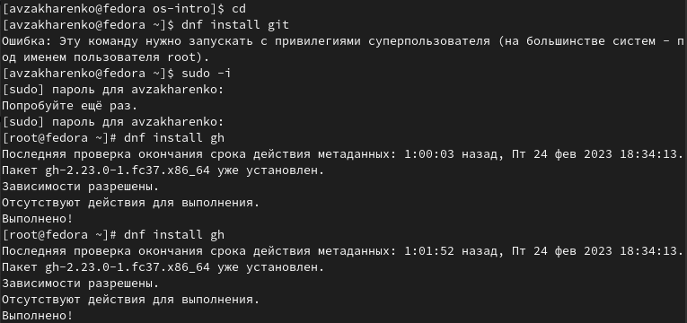
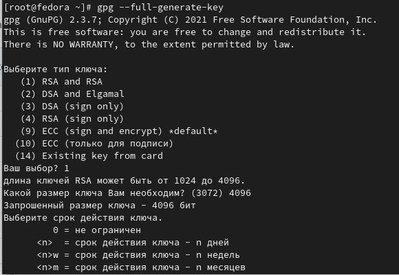
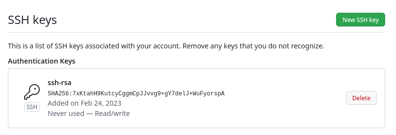
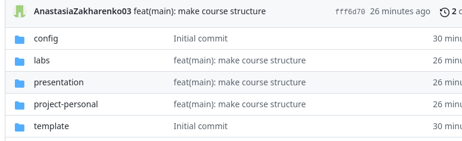

---
## Front matter
title: "Лабораторная работа № 2"
subtitle: "Первоначальная настройка git."
author: "Захаренко Анастасия Викторовна"

## Generic otions
lang: ru-RU
toc-title: "Содержание"

## Bibliography
bibliography: bib/cite.bib
csl: pandoc/csl/gost-r-7-0-5-2008-numeric.csl

## Pdf output format
toc: true # Table of contents
toc-depth: 2
lof: true # List of figures
lot: true # List of tables
fontsize: 12pt
linestretch: 1.5
papersize: a4
documentclass: scrreprt
## I18n polyglossia
polyglossia-lang:
  name: russian
  options:
	- spelling=modern
	- babelshorthands=true
polyglossia-otherlangs:
  name: english
## I18n babel
babel-lang: russian
babel-otherlangs: english
## Fonts
mainfont: PT Serif
romanfont: PT Serif
sansfont: PT Sans
monofont: PT Mono
mainfontoptions: Ligatures=TeX
romanfontoptions: Ligatures=TeX
sansfontoptions: Ligatures=TeX,Scale=MatchLowercase
monofontoptions: Scale=MatchLowercase,Scale=0.9
## Biblatex
biblatex: true
biblio-style: "gost-numeric"
biblatexoptions:
  - parentracker=true
  - backend=biber
  - hyperref=auto
  - language=auto
  - autolang=other*
  - citestyle=gost-numeric
## Pandoc-crossref LaTeX customization
figureTitle: "Рис."
tableTitle: "Таблица"
listingTitle: "Листинг"
lofTitle: "Список иллюстраций"
lotTitle: "Список таблиц"
lolTitle: "Листинги"
## Misc options
indent: true
header-includes:
  - \usepackage{indentfirst}
  - \usepackage{float} # keep figures where there are in the text
  - \floatplacement{figure}{H} # keep figures where there are in the text
---

# Цель работы

Изучить идеологию и применение средств контроля версий.
Освоить умения по работе с git.

# Задание

Создать базовую конфигурацию для работы с git.
Создать ключ SSH.
Создать ключ PGP.
Настроить подписи git.
Зарегистрироваться на Github.
Создать локальный каталог для выполнения заданий по предмету.

# Теоретическое введение

Системы контроля версий (Version Control System, VCS) применяются при работе нескольких человек над одним проектом. Обычно основное дерево проекта хранится в локальном или удалённом репозитории, к которому настроен доступ для участников проекта. При внесении изменений в содержание проекта система контроля версий позволяет их фиксировать, совмещать изменения, произведённые разными участниками проекта, производить откат к любой более ранней версии проекта, если это требуется.
Среди классических VCS наиболее известны CVS, Subversion, а среди распределённых — Git, Bazaar, Mercurial. Принципы их работы схожи, отличаются они в основном синтаксисом используемых в работе команд.

# Выполнение лабораторной работы

Установка программного обеспечения

Установим git и gh:

Базовая настройка git

Зададим имя и email владельца репозитория:

Настроим utf-8 в выводе сообщений git:

Зададим имя начальной ветки (будем называть её master):

Параметр autocrlf:

Параметр safecrlf:

Создаем ключи ssh

по алгоритму rsa с ключём размером 4096 бит:

по алгоритму ed25519:

Создаем ключи pgp

Генерируем ключ

Из предложенных опций выбрали:
1. тип RSA and RSA;
2. размер 4096;
3. выберите срок действия; значение по умолчанию — 0 (срок действия не истекает никогда).
Ввели личную информацию, которая сохранится в ключе

Добавление PGP ключа в GitHub

Выводим список ключей и копируем отпечаток приватного ключа:

Настройка автоматических подписей коммитов git

Используя введёный email, указываем Git применять его при подписи коммитов:

Настройка gh

Для начала необходимо авторизоваться

Сознание репозитория курса на основе шаблона

создать шаблон рабочего пространства 

Настройка каталога курса

Перейдите в каталог курса:

Удалите лишние файлы:

Создайте необходимые каталоги:

Отправьте файлы на сервер:

#Контрольные вопросы
1. Что такое системы контроля версий (VCS) и для решения каких задач они предназначаются?
2. Объясните следующие понятия VCS и их отношения: хранилище, commit, история, рабочая копия.
3. Что представляют собой и чем отличаются централизованные и децентрализованные VCS? Приведите примеры VCS каждого вида.
4. Опишите действия с VCS при единоличной работе с хранилищем.
5. Опишите порядок работы с общим хранилищем VCS.
6. Каковы основные задачи, решаемые инструментальным средством git?
7. Назовите и дайте краткую характеристику командам git.
8. Приведите примеры использования при работе с локальным и удалённым репозиториями.
9. Что такое и зачем могут быть нужны ветви (branches)?
10. Как и зачем можно игнорировать некоторые файлы при commit?

#Ответы на контрольные вопросы

1. Контроль версий, также известный как управление исходным кодом, — это практика отслеживания изменений программного кода и управления ими. Системы контроля версий — это программные инструменты, помогающие командам разработчиков управлять изменениями в исходном коде с течением времени.
2. Репозиторий - хранилище версий - в нем
хранятся все документы вместе с историей их
изменения и другой служебной информацией.
Рабочая копия - копия проекта, связанная с
репозиторием
Коммит, фиксация commit, checkin-сохранение изменений в
репозитории
3. Централизованные VCS. Клиент-серверная модель: один центральный репозиторий, с которым разработчики взаимодействуют по сети.Примеры:CVS- одна из первых систем второго поколения (1986г.). Обладает множеством недостатков и считается устаревшей.Subversion (SVN) – система второго поколения, созданная для замены CVS. Одна из самых распространенных систем контроля версий.
Распределенные системы контроля версий (Distributed Version Control System, DVCS) позволяют хранить репозиторий (его копию) у каждого разработчика, работающего с данной системой. При этом можно выделить центральный репозиторий (условно), в который будут отправляться изменения из локальных и, с ним же эти локальные репозитории будут синхронизироваться. Mercurial,Git
4. В классических системах контроля версий используется централизованная модель, предполагающая наличие единого репозитория для хранения файлов. Выполнение большинства функций по управлению версиями осуществляется специальным сервером. Участник проекта (пользователь) перед началом работы посредством определённых команд получает нужную ему версию файлов. После внесения изменений, пользователь размещает новую версию в хранилище. При этом предыдущие версии не удаляются из центрального хранилища и к ним можно вернуться в любой момент. Сервер может сохранять не полную версию изменённых файлов, а производить так называемую дельта-компрессию — сохранять только изменения между последовательными версиями, что позволяет уменьшить объём хранимых данных.
5. Системы контроля версий поддерживают возможность отслеживания и разрешения конфликтов, которые могут возникнуть при работе нескольких человек над одним файлом. Можно объединить (слить) изменения, сделанные разными участниками (автоматически или вручную), вручную выбрать нужную версию, отменить изменения вовсе или заблокировать файлы для изменения. В зависимости от настроек блокировка не позволяет другим пользователям получить рабочую копию или препятствует изменению рабочей копии файла средствами файловой системы ОС, обеспечивая таким образом, привилегированный доступ только одному пользователю, работающему с файлом.
6. Примеры использования gitСистема контроля версий Git представляет собой набор программ командной строки. Доступ к ним можно получить из терминала посредством ввода команды git с различными опциями.Благодаря тому, что Git является распределённой системой контроля версий, резервную копию локального хранилища можно сделать простым копированием или архивацией.
7. Основные команды git:
Перечислим наиболее часто используемые команды git.
Создание основного дерева репозитория:
    git init
Получение обновлений (изменений) текущего дерева из центрального репозитория:
    git pull
Отправка всех произведённых изменений локального дерева в центральный репозиторий:
    git push
Просмотр списка изменённых файлов в текущей директории:
    git status
Просмотр текущих изменений:
    git diff
Сохранение текущих изменений:
добавить все изменённые и/или созданные файлы и/или каталоги:
    git add .
добавить конкретные изменённые и/или созданные файлы и/или каталоги:
    git add имена_файлов
удалить файл и/или каталог из индекса репозитория (при этом файл и/или каталог остаётся в локальной директории):
    git rm имена_файлов
Сохранение добавленных изменений:
сохранить все добавленные изменения и все изменённые файлы:
    git commit -am 'Описание коммита'
сохранить добавленные изменения с внесением комментария через встроенный редактор:
    git commit
создание новой ветки, базирующейся на текущей:
    git checkout -b имя_ветки
переключение на некоторую ветку:
    git checkout имя_ветки
(при переключении на ветку, которой ещё нет в локальном репозитории, она будет создана и связана с удалённой)
отправка изменений конкретной ветки в центральный репозиторий:
    git push origin имя_ветки
слияние ветки с текущим деревом:
    git merge --no-ff имя_ветки
Удаление ветки:
удаление локальной уже слитой с основным деревом ветки:
    git branch -d имя_ветки
принудительное удаление локальной ветки:
    git branch -D имя_ветки
удаление ветки с центрального репозитория:
    git push origin :имя_ветки
8. Создадим локальный репозиторий.
Сначала сделаем предварительную конфигурацию, указав имя и email владельца репозитория:
    git config --global user.name "Имя Фамилия"
    git config --global  user.email "work@mail"
Настроим utf-8 в выводе сообщений git:
    git config --global quotepath false
Для инициализации локального репозитория, расположенного, например, в каталоге ~/tutorial, необходимо ввести в командной строке:
    cd 
    mkdir tutorial
    cd tutorial
    git init
После это в каталоге tutorial появится каталог .git, в котором будет храниться история изменений.
Создадим тестовый текстовый файл hello.txt и добавим его в локальный репозиторий:
    echo 'hello world' > hello.txt
    git add hello.txt
    git commit -am 'Новый файл'
Воспользуемся командой status для просмотра изменений в рабочем каталоге, сделанных с момента последней ревизии:
    git status
Во время работы над проектом так или иначе могут создаваться файлы, которые не требуется добавлять в последствии в репозиторий. Например, временные файлы, создаваемые редакторами, или объектные файлы, создаваемые компиляторами. Можно прописать шаблоны игнорируемых при добавлении в репозиторий типов файлов в файл .gitignore с помощью сервисов. Для этого сначала нужно получить список имеющихся шаблонов:
    curl -L -s https://www.gitignore.io/api/list
Затем скачать шаблон, например, для C и C++
    curl -L -s https://www.gitignore.io/api/c >> .gitignore
    curl -L -s https://www.gitignore.io/api/c++ >> .gitignore
9. Ветки нужны для того, чтобы программисты могли вести совместную работу над проектом и не мешать друг другу при этом. При создании проекта, Git создает базовую ветку. Она называется master веткой.
10. Можно принудительно сделать коммит игнорируемого файла в репозиторий с помощью команды git add с параметром -f (или --force)
Этот способ хорош, если у вас задан общий шаблон (например, *.log), но вы хотите сделать коммит определенного файла. Однако еще лучше в этом случае задать исключение из общего правила:

# Выводы

Мы изучили идеологию и применение средств контроля версий и освоили умения по работе с git.

# Список литературы{.unnumbered}

::: {#refs}
:::
