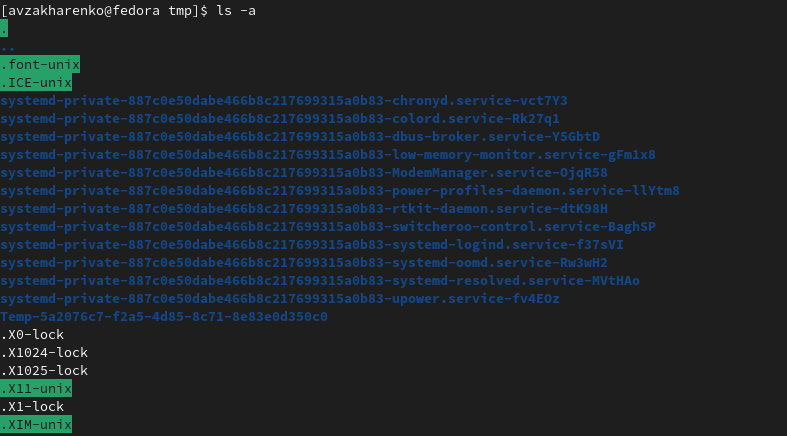

---
## Front matter
lang: ru-RU
title: "Лабораторная работа No 4.
subtitle: "Основы интерфейса взаимодействия
пользователя с системой Unix на уровне командной строки"
author:
  - "Захаренко Анастасия Викторовна"
institute:
  - Российский университет дружбы народов, Москва, Россия
date: 04.03.2023

## i18n babel
babel-lang: russian
babel-otherlangs: english

## Formatting pdf
toc: false
toc-title: Содержание
slide_level: 2
aspectratio: 169
section-titles: true
theme: metropolis
header-includes:
 - \metroset{progressbar=frametitle,sectionpage=progressbar,numbering=fraction}
 - '\makeatletter'
 - '\beamer@ignorenonframefalse'
 - '\makeatother'
---

# Информация

## Докладчик


  * Захаренко Анастасия Викторовна
  * Студентка факультета физико-математических и естественных наук
  * Российский университет дружбы народов


# Вводная часть

## Актуальность

Важно приобрести практические навыки взаимодействия пользователя с системой по-
средством командной строки.


## Цели и задачи

1. Определите полное имя вашего домашнего каталога. Далее относительно этого ката-
лога будут выполняться последующие упражнения.
2. Выполните следующие действия:
2.1. Перейдите в каталог /tmp.
2.2. Выведите на экран содержимое каталога /tmp. Для этого используйте команду ls
с различными опциями. Поясните разницу в выводимой на экран информации.
2.3. Определите, есть ли в каталоге /var/spool подкаталог с именем cron?
2.4. Перейдите в Ваш домашний каталог и выведите на экран его содержимое. Опре-
делите, кто является владельцем файлов и подкаталогов?
3. Выполните следующие действия:
3.1. В домашнем каталоге создайте новый каталог с именем newdir.
3.2. В каталоге ~/newdir создайте новый каталог с именем morefun.
3.3. В домашнем каталоге создайте одной командой три новых каталога с именами
letters, memos, misk. Затем удалите эти каталоги одной командой.
3.4. Попробуйте удалить ранее созданный каталог ~/newdir командой rm. Проверьте,
был ли каталог удалён.
3.5. Удалите каталог ~/newdir/morefun из домашнего каталога. Проверьте, был ли
каталог удалён.
4. С помощью команды man определите, какую опцию команды ls нужно использо-
вать для просмотра содержимое не только указанного каталога, но и подкаталогов,
входящих в него.
5. С помощью команды man определите набор опций команды ls, позволяющий отсорти-
ровать по времени последнего изменения выводимый список содержимого каталога
с развёрнутым описанием файлов.
6. Используйте команду man для просмотра описания следующих команд: cd, pwd, mkdir,
rmdir, rm. Поясните основные опции этих команд.
7. Используя информацию, полученную при помощи команды history, выполните мо-
дификацию и исполнение нескольких команд из буфера команд.

## Материалы и методы

Команда man. Команда man используется для просмотра (оперативная помощь) в диа-
логовом режиме руководства (manual) по основным командам операционной системы
типа Linux

Команда cd. Команда cd используется для перемещения по файловой системе опера-
ционной системы типа Linux.

Команда pwd. Для определения абсолютного пути к текущему каталогу используется
команда pwd (print working directory)

Команда ls. Команда ls используется для просмотра содержимого каталога

Команда mkdir. Команда mkdir используется для создания каталогов.

Команда rm. Команда rm используется для удаления файлов и/или каталогов.

Команда history. Для вывода на экран списка ранее выполненных команд исполь-
зуется команда history. Выводимые на экран команды в списке нумеруются. К любой
команде из выведенного на экран списка можно обратиться по её номеру в списке,
воспользовавшись конструкцией !<номер_команды>.

# Выполнение лабораторной работы

## 1. 
Определяем полное имя нешего домашнего каталога. Далее относительно этого каталога будут выполняться последующие упражнения.


## 2.Выполняем следующие действия:
## 2.1. 
Переходим в каталог /tmp.


## 2.2. 
Выводим на экран содержимое каталога /tmp. Для этого используем команду ls
с различными опциями.




## 2.3. 
Определяем, есть ли в каталоге /var/spool подкаталог с именем cron.
2.4. Переходим в наш домашний каталог и выводим на экран его содержимое. Опре-
деляем, кто является владельцем файлов и подкаталогов


##3. Выполняем следующие действия:
3.1. В домашнем каталоге создаем новый каталог с именем newdir.
3.2. В каталоге ~/newdir создаем новый каталог с именем morefun.
3.3. В домашнем каталоге создаем одной командой три новых каталога с именами
letters, memos, misk. Затем удаляем эти каталоги одной командой.
3.4. Пробуем удалить ранее созданный каталог ~/newdir командой rm. Проверяем,
был ли каталог удалён.
##


##
##
##
##
##
##
##
##
## Код для формата `pdf`

```yaml
slide_level: 2
aspectratio: 169
section-titles: true
theme: metropolis
```

## Формат `html`

- Используется фреймворк [reveal.js](https://revealjs.com/)
- Используется [тема](https://revealjs.com/themes/) `beige`

## Код для формата `html`

- Тема задаётся в файле `Makefile`

```make
REVEALJS_THEME = beige 
```
# Результаты

## Получающиеся форматы

- Полученный `pdf`-файл можно демонстрировать в любой программе просмотра `pdf`
- Полученный `html`-файл содержит в себе все ресурсы: изображения, css, скрипты

# Элементы презентации

## Актуальность

- Даёт понять, о чём пойдёт речь
- Следует широко и кратко описать проблему
- Мотивировать свое исследование
- Сформулировать цели и задачи
- Возможна формулировка ожидаемых результатов

## Цели и задачи

- Не формулируйте более 1--2 целей исследования

## Материалы и методы

- Представляйте данные качественно
- Количественно, только если крайне необходимо
- Излишние детали не нужны

## Содержание исследования

- Предлагаемое решение задач исследования с обоснованием
- Основные этапы работы

## Результаты

- Не нужны все результаты
- Необходимы логические связки между слайдами
- Необходимо показать понимание материала


## Итоговый слайд

- Запоминается последняя фраза. © Штирлиц
- Главное сообщение, которое вы хотите донести до слушателей
- Избегайте использовать последний слайд вида *Спасибо за внимание*

# Рекомендации

## Принцип 10/20/30

  - 10 слайдов
  - 20 минут на доклад
  - 30 кегль шрифта

## Связь слайдов

::: incremental

- Один слайд --- одна мысль
- Нельзя ссылаться на объекты, находящиеся на предыдущих слайдах (например, на формулы)
- Каждый слайд должен иметь заголовок

:::

## Количество сущностей

::: incremental

- Человек может одновременно помнить $7 \pm 2$ элемента
- При размещении информации на слайде старайтесь чтобы в сумме слайд содержал не более 5 элементов
- Можно группировать элементы так, чтобы визуально было не более 5 групп

:::

## Общие рекомендации

::: incremental

- На слайд выносится та информация, которая без зрительной опоры воспринимается хуже
- Слайды должны дополнять или обобщать содержание выступления или его частей, а не дублировать его
- Информация на слайдах должна быть изложена кратко, чётко и хорошо структурирована
- Слайд не должен быть перегружен графическими изображениями и текстом
- Не злоупотребляйте анимацией и переходами

:::

## Представление данных

::: incremental

- Лучше представить в виде схемы
- Менее оптимально представить в виде рисунка, графика, таблицы
- Текст используется, если все предыдущие способы отображения информации не подошли

:::

