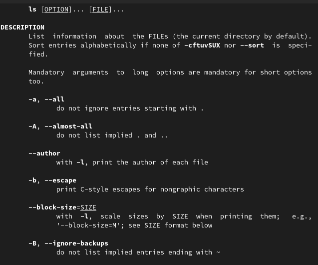

---
## Front matter
title: "Лабораторная работа No 4."
subtitle: "Основы интерфейса взаимодействия
пользователя с системой Unix на уровне командной строки"
author: "Захаренко Анастасия Викторовна"

## Generic otions
lang: ru-RU
toc-title: "Содержание"

## Bibliography
bibliography: bib/cite.bib
csl: pandoc/csl/gost-r-7-0-5-2008-numeric.csl

## Pdf output format
toc: true # Table of contents
toc-depth: 2
lof: true # List of figures
lot: true # List of tables
fontsize: 12pt
linestretch: 1.5
papersize: a4
documentclass: scrreprt
## I18n polyglossia
polyglossia-lang:
  name: russian
  options:
	- spelling=modern
	- babelshorthands=true
polyglossia-otherlangs:
  name: english
## I18n babel
babel-lang: russian
babel-otherlangs: english
## Fonts
mainfont: PT Serif
romanfont: PT Serif
sansfont: PT Sans
monofont: PT Mono
mainfontoptions: Ligatures=TeX
romanfontoptions: Ligatures=TeX
sansfontoptions: Ligatures=TeX,Scale=MatchLowercase
monofontoptions: Scale=MatchLowercase,Scale=0.9
## Biblatex
biblatex: true
biblio-style: "gost-numeric"
biblatexoptions:
  - parentracker=true
  - backend=biber
  - hyperref=auto
  - language=auto
  - autolang=other*
  - citestyle=gost-numeric
## Pandoc-crossref LaTeX customization
figureTitle: "Рис."
tableTitle: "Таблица"
listingTitle: "Листинг"
lofTitle: "Список иллюстраций"
lotTitle: "Список таблиц"
lolTitle: "Листинги"
## Misc options
indent: true
header-includes:
  - \usepackage{indentfirst}
  - \usepackage{float} # keep figures where there are in the text
  - \floatplacement{figure}{H} # keep figures where there are in the text
---

# Цель работы

Приобретение практических навыков взаимодействия пользователя с системой по-
средством командной строки.

# Задание

1. Определите полное имя вашего домашнего каталога. Далее относительно этого ката-
лога будут выполняться последующие упражнения.
2. Выполните следующие действия:
2.1. Перейдите в каталог /tmp.
2.2. Выведите на экран содержимое каталога /tmp. Для этого используйте команду ls
с различными опциями. Поясните разницу в выводимой на экран информации.
2.3. Определите, есть ли в каталоге /var/spool подкаталог с именем cron?
2.4. Перейдите в Ваш домашний каталог и выведите на экран его содержимое. Опре-
делите, кто является владельцем файлов и подкаталогов?
3. Выполните следующие действия:
3.1. В домашнем каталоге создайте новый каталог с именем newdir.
3.2. В каталоге ~/newdir создайте новый каталог с именем morefun.
3.3. В домашнем каталоге создайте одной командой три новых каталога с именами
letters, memos, misk. Затем удалите эти каталоги одной командой.
3.4. Попробуйте удалить ранее созданный каталог ~/newdir командой rm. Проверьте,
был ли каталог удалён.
3.5. Удалите каталог ~/newdir/morefun из домашнего каталога. Проверьте, был ли
каталог удалён.
4. С помощью команды man определите, какую опцию команды ls нужно использо-
вать для просмотра содержимое не только указанного каталога, но и подкаталогов,
входящих в него.
5. С помощью команды man определите набор опций команды ls, позволяющий отсорти-
ровать по времени последнего изменения выводимый список содержимого каталога
с развёрнутым описанием файлов.
6. Используйте команду man для просмотра описания следующих команд: cd, pwd, mkdir,
rmdir, rm. Поясните основные опции этих команд.
7. Используя информацию, полученную при помощи команды history, выполните мо-
дификацию и исполнение нескольких команд из буфера команд.

# Теоретическое введение

Команда man. Команда man используется для просмотра (оперативная помощь) в диа-
логовом режиме руководства (manual) по основным командам операционной системы
типа Linux

Команда cd. Команда cd используется для перемещения по файловой системе опера-
ционной системы типа Linux.

Команда pwd. Для определения абсолютного пути к текущему каталогу используется
команда pwd (print working directory)

Команда ls. Команда ls используется для просмотра содержимого каталога

Команда mkdir. Команда mkdir используется для создания каталогов.

Команда rm. Команда rm используется для удаления файлов и/или каталогов.

Команда history. Для вывода на экран списка ранее выполненных команд исполь-
зуется команда history. Выводимые на экран команды в списке нумеруются. К любой
команде из выведенного на экран списка можно обратиться по её номеру в списке,
воспользовавшись конструкцией !<номер_команды>.

# Выполнение лабораторной работы

1. Определяем полное имя нешего домашнего каталога. Далее относительно этого ката-
лога будут выполняться последующие упражнения.

2. Выполняем следующие действия:
2.1. Переходим в каталог /tmp.

2.2. Выводим на экран содержимое каталога /tmp. Для этого используем команду ls
с различными опциями.

2.3. Определяем, есть ли в каталоге /var/spool подкаталог с именем cron.
2.4. Переходим в наш домашний каталог и выводим на экран его содержимое. Опре-
деляем, кто является владельцем файлов и подкаталогов

3. Выполняем следующие действия:
3.1. В домашнем каталоге создаем новый каталог с именем newdir.
3.2. В каталоге ~/newdir создаем новый каталог с именем morefun.
3.3. В домашнем каталоге создаем одной командой три новых каталога с именами
letters, memos, misk. Затем удаляем эти каталоги одной командой.
3.4. Пробуем удалить ранее созданный каталог ~/newdir командой rm. Проверяем,
был ли каталог удалён.

4. С помощью команды man определяем, какую опцию команды ls нужно использо-
вать для просмотра содержимое не только указанного каталога, но и подкаталогов,
входящих в него.
5. С помощью команды man определяем набор опций команды ls, позволяющий отсорти-
ровать по времени последнего изменения выводимый список содержимого каталога
с развёрнутым описанием файлов.

6. Используем команду man для просмотра описания следующих команд: cd, pwd, mkdir,
rmdir, rm.

7. Используя информацию, полученную при помощи команды history, выполняем мо-
дификацию и исполнение нескольких команд из буфера команд.

Контрольные вопросы
1. Что такое командная строка?
Командой в операционной системе называется записанный по
специальным правилам текст (возможно с аргументами), представляющий собой ука-
зание на выполнение какой-либо функций (или действий) в операционной системе
2. При помощи какой команды можно определить абсолютный путь текущего каталога?
Приведите пример.
Для определения абсолютного пути к текущему каталогу используется
команда pwd (print working directory).
Пример (абсолютное имя текущего каталога пользователя dharma):
1 pwd
3. При помощи какой команды и каких опций можно определить только тип файлов
и их имена в текущем каталоге? Приведите примеры.
Команда ls. Команда ls используется для просмотра содержимого каталога.
Формат команды:
ls [-опции] [путь]
Пример:
1 cd
2 cd ..
3 pwd
4
5 /afs/dk.sci.pfu.edu.ru/home/d/h
6
7 ls
8
9 dharma
4. Каким образом отобразить информацию о скрытых файлах? Приведите примеры.
Для
того, чтобы отобразить имена скрытых файлов, необходимо использовать команду ls
с опцией a:
1 ls -a
5. При помощи каких команд можно удалить файл и каталог? Можно ли это сделать
одной и той же командой? Приведите примеры.
Команда rm используется для удаления файлов и/или каталогов.
Формат команды:
rm [-опции] [файл]
Если требуется, чтобы выдавался запрос подтверждения на удаление файла, то необхо-
димо использовать опцию i.
Чтобы удалить каталог, содержащий файлы, нужно использовать опцию r. Без указания
этой опции команда не будет выполняться.
Пример:
1 cd
2 mkdir abs
3 rm abc
4
5 rm: abc is a directory
6
7 rm -r abc
Если каталог пуст, то можно воспользоваться командой rmdir. Если удаляемый
каталог содержит файлы, то команда не будет выполнена — нужно использовать rm -
r имя_каталога.
6. Каким образом можно вывести информацию о последних выполненных пользовате-
лем командах? работы?
Для вывода на экран списка ранее выполненных команд исполь-
зуется команда history. Выводимые на экран команды в списке нумеруются. К любой
команде из выведенного на экран списка можно обратиться по её номеру в списке,
воспользовавшись конструкцией !<номер_команды>.
Пример:
1 history
2 1 pwd
3 2 ls
4 3 ls -a
5 4 ls -l
6 5 cd /
7 6 history
8
9 !5
10 cd /
7. Как воспользоваться историей команд для их модифицированного выполнения? При-
ведите примеры.
Можно модифицировать команду из выведенного на экран списка при помощи следу-
ющей конструкции:
!<номер_команды>:s/<что_меняем>/<на_что_меняем>
Пример:
1 !3:s/a/F
2 ls -F
8. Приведите примеры запуска нескольких команд в одной строке.
Если требуется выполнить последовательно несколько
команд, записанный в одной строке, то для этого используется символ точка с запятой
Пример:
1 cd; ls
9. Дайте определение и приведите примера символов экранирования.
Экранирование — это способ заключения в кавычки одиночного символа. Экранирующий (escape) символ (\) сообщает интерпретатору, что следующий за ним символ должен восприниматься как обычный символ.
echo "Привет"                    # Привет
echo "Он сказал: \"Привет\"."    # Он сказал: "Привет".
echo "\$variable01"  # выведет $variable01

10. Охарактеризуйте вывод информации на экран после выполнения команды ls с опцией
l.
Чтобы вывести на экран подробную информацию о файлах и каталогах, необходимо
использовать опцию l. При этом о каждом файле и каталоге будет выведена следующая
информация:
– тип файла,
– право доступа,
– число ссылок,
– владелец,
– размер,
– дата последней ревизии,
– имя файла или каталога
11. Что такое относительный путь к файлу? Приведите примеры использования относи-
тельного и абсолютного пути при выполнении какой-либо команды.
Абсолютный путь показывает точное местонахождение файла, а относительный показывает путь к файлу относительно какой-либо "отправной точки"
Например, команда
1 cd /afs/dk.sci.pfu.edu.ru/home
Пример (абсолютное имя текущего каталога пользователя dharma):
1 pwd
результат:
1 /afs/dk.sci.pfu.edu.ru/home/d/h/dharma
12. Как получить информацию об интересующей вас команде?
Команда man используется для просмотра (оперативная помощь) в диа-
логовом режиме руководства (manual) по основным командам операционной системы
типа Linux.
Формат команды:
man <команда>
Пример (вывод информации о команде man):
1 man man
13. Какая клавиша или комбинация клавиш служит для автоматического дополнения
вводимых команд?
TAB

Клавиша TAB — поможет дополнить команду или путь к файлу или предложит варианты, если их несколько.
Для использования данного функционала начните набирать команду и нажмите TAB после введения нескольких символов.

    Одно нажатие — дополняет команду.
    Два нажатия — предлагает несколько вариантов, если введенный текст имеет несколько вариантов продолжения. Например, двойное нажатие Tab поможет написать длинный путь к нужному файлу или директории.

# Выводы

В ходе выполнения работы я приобрела практические навыки взаимодействия пользователя с системой по-
средством командной строки.
