---
## Front matter
title: " Лабораторная работа No 5."
subtitle: "Анализ файловой системы Linux.Команды для работы с файлами и каталогами"
author: "Захаренко Анастасия Викторовна"

## Generic otions
lang: ru-RU
toc-title: "Содержание"

## Bibliography
bibliography: bib/cite.bib
csl: pandoc/csl/gost-r-7-0-5-2008-numeric.csl

## Pdf output format
toc: true # Table of contents
toc-depth: 2
lof: true # List of figures
lot: true # List of tables
fontsize: 12pt
linestretch: 1.5
papersize: a4
documentclass: scrreprt
## I18n polyglossia
polyglossia-lang:
  name: russian
  options:
	- spelling=modern
	- babelshorthands=true
polyglossia-otherlangs:
  name: english
## I18n babel
babel-lang: russian
babel-otherlangs: english
## Fonts
mainfont: PT Serif
romanfont: PT Serif
sansfont: PT Sans
monofont: PT Mono
mainfontoptions: Ligatures=TeX
romanfontoptions: Ligatures=TeX
sansfontoptions: Ligatures=TeX,Scale=MatchLowercase
monofontoptions: Scale=MatchLowercase,Scale=0.9
## Biblatex
biblatex: true
biblio-style: "gost-numeric"
biblatexoptions:
  - parentracker=true
  - backend=biber
  - hyperref=auto
  - language=auto
  - autolang=other*
  - citestyle=gost-numeric
## Pandoc-crossref LaTeX customization
figureTitle: "Рис."
tableTitle: "Таблица"
listingTitle: "Листинг"
lofTitle: "Список иллюстраций"
lotTitle: "Список таблиц"
lolTitle: "Листинги"
## Misc options
indent: true
header-includes:
  - \usepackage{indentfirst}
  - \usepackage{float} # keep figures where there are in the text
  - \floatplacement{figure}{H} # keep figures where there are in the text
---

# Цель работы

Ознакомление с файловой системой Linux, её структурой, именами и содержанием
каталогов. Приобретение практических навыков по применению команд для работы
с файлами и каталогами, по управлению процессами (и работами), по проверке исполь-
зования диска и обслуживанию файловой системы

# Задание

1. Выполните все примеры, приведённые в первой части описания лабораторной работы.
2. Выполните следующие действия, зафиксировав в отчёте по лабораторной работе
используемые при этом команды и результаты их выполнения:
2.1. Скопируйте файл /usr/include/sys/io.h в домашний каталог и назовите его
equipment. Если файла io.h нет, то используйте любой другой файл в каталоге
/usr/include/sys/ вместо него.
2.2. В домашнем каталоге создайте директорию ~/ski.plases.
2.3. Переместите файл equipment в каталог ~/ski.plases.
2.4. Переименуйте файл ~/ski.plases/equipment в ~/ski.plases/equiplist.
2.5. Создайте в домашнем каталоге файл abc1 и скопируйте его в каталог
~/ski.plases, назовите его equiplist2.
2.6. Создайте каталог с именем equipment в каталоге ~/ski.plases.
2.7. Переместите файлы ~/ski.plases/equiplist и equiplist2 в каталог
~/ski.plases/equipment.
2.8. Создайте и переместите каталог ~/newdir в каталог ~/ski.plases и назовите
его plans.
3. Определите опции команды chmod, необходимые для того, чтобы присвоить перечис-
ленным ниже файлам выделенные права доступа, считая, что в начале таких прав
нет:
3.1. drwxr--r-- ... australia
3.2. drwx--x--x ... play
3.3. -r-xr--r-- ... my_os
3.4. -rw-rw-r-- ... feathers
При необходимости создайте нужные файлы.
4. Проделайте приведённые ниже упражнения, записывая в отчёт по лабораторной
работе используемые при этом команды:
4.1. Просмотрите содержимое файла /etc/password.
4.2. Скопируйте файл ~/feathers в файл ~/file.old.
4.3. Переместите файл ~/file.old в каталог ~/play.
4.4. Скопируйте каталог ~/play в каталог ~/fun.
4.5. Переместите каталог ~/fun в каталог ~/play и назовите его games.
4.6. Лишите владельца файла ~/feathers права на чтение.
4.7. Что произойдёт, если вы попытаетесь просмотреть файл ~/feathers командой
cat?
4.8. Что произойдёт, если вы попытаетесь скопировать файл ~/feathers?
4.9. Дайте владельцу файла ~/feathers право на чтение.
4.10. Лишите владельца каталога ~/play права на выполнение.
4.11. Перейдите в каталог ~/play. Что произошло?
4.12. Дайте владельцу каталога ~/play право на выполнение.
5. Прочитайте man по командам mount, fsck, mkfs, kill и кратко их охарактеризуйте,
приведя примеры.
# Теоретическое введение

Команды для работы с файлами и каталогами
Для создания текстового файла можно использовать команду touch.
Формат команды:
1 touch имя-файла
Для просмотра файлов небольшого размера можно использовать команду cat.
Формат команды:
1 cat имя-файла
Копирование файлов и каталогов
Команда cp используется для копирования файлов и каталогов.
Формат команды:
1 cp [-опции] исходный_файл целевой_файл
Перемещение и переименование файлов и каталогов
Команды mv и mvdir предназначены для перемещения и переименования файлов
и каталогов.
Формат команды mv
mv [-опции] старый_файл новый_файл
Права доступа
Каждый файл или каталог имеет права доступа (табл. 5.1).
В сведениях о файле или каталоге указываются:
– тип файла (символ (-) обозначает файл, а символ (d) — каталог);
– права для владельца файла (r — разрешено чтение, w — разрешена запись, x — разре-
шено выполнение, - — право доступа отсутствует);
– права для членов группы (r — разрешено чтение, w — разрешена запись, x — разрешено
выполнение, - — право доступа отсутствует);
– права для всех остальных (r — разрешено чтение, w — разрешена запись, x — разрешено
выполнение, - — право доступа отсутствует).
# Выполнение лабораторной работы

1. Выполните все примеры, приведённые в первой части описания лабораторной работы
Копирование файлов и каталогов
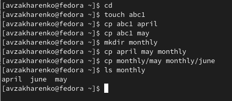

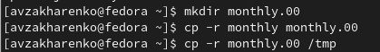

Перемещение и переименование файлов и каталогов

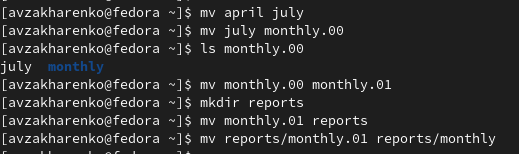

Права доступа

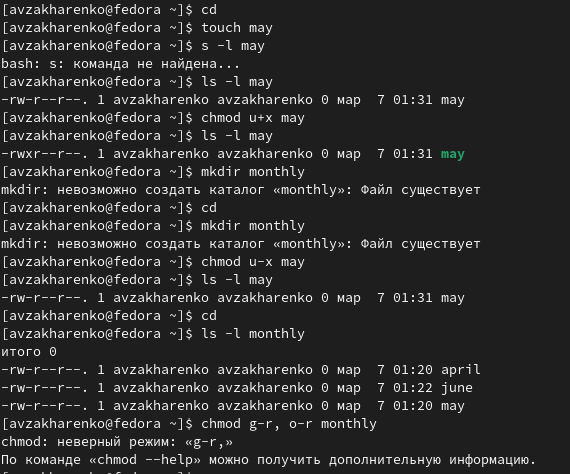

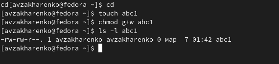

2. Выполняем следующие действия:
2.1. Скопируем файл /usr/include/sys/io.h в домашний каталог и называем его
equipment.
2.2. В домашнем каталоге создаем директорию ~/ski.plases.
2.3. Перемещаем файл equipment в каталог ~/ski.plases.
2.4. Переименуем файл ~/ski.plases/equipment в ~/ski.plases/equiplist.
2.5. Создаем в домашнем каталоге файл abc1 и копируем его в каталог
~/ski.plases, называем его equiplist2.
2.6. Создаем каталог с именем equipment в каталоге ~/ski.plases.
2.7. Перемещаем файлы ~/ski.plases/equiplist и equiplist2 в каталог
~/ski.plases/equipment.

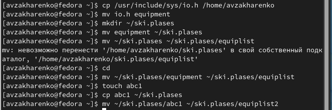

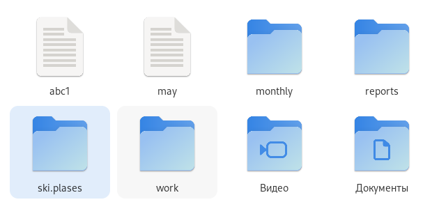

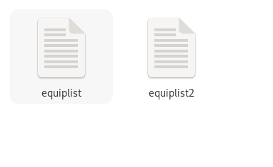

2.8. Создаем и перемещаем каталог ~/newdir в каталог ~/ski.plases и называем
его plans.

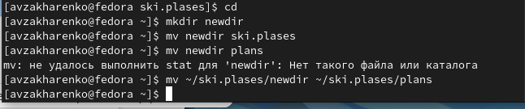

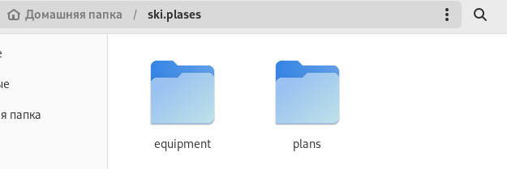

3. Определите опции команды chmod, необходимые для того, чтобы присвоить перечис-
ленным ниже файлам выделенные права доступа, считая, что в начале таких прав
нет:
3.1. drwxr--r-- ... australia
3.2. drwx--x--x ... play
3.3. -r-xr--r-- ... my_os
3.4. -rw-rw-r-- ... feathers

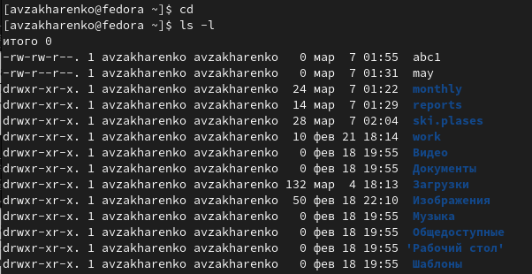

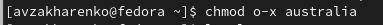

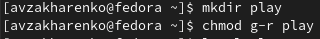

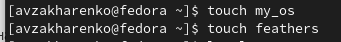

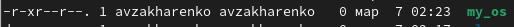

4. Проделаем приведённые ниже упражнения:
4.1. Просмотрим содержимое файла /etc/password.
4.2. Скопируем файл ~/feathers в файл ~/file.old.
4.3. Переместим файл ~/file.old в каталог ~/play.
4.4. Скопируем каталог ~/play в каталог ~/fun.
4.5. Переместим каталог ~/fun в каталог ~/play и назовем его games.
4.6. Лишаем владельца файла ~/feathers права на чтение.
4.7. Что произойдёт, если вы попытаетесь просмотреть файл ~/feathers командой
cat?-отказ в доступе
4.8. Что произойдёт, если вы попытаетесь скопировать файл ~/feathers?
4.9. Даем владельцу файла ~/feathers право на чтение.

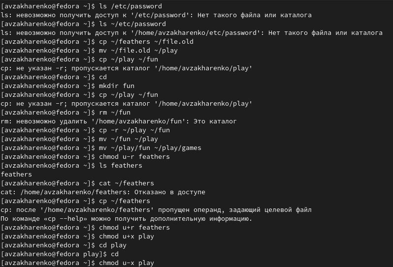

4.10. Лишаем владельца каталога ~/play права на выполнение.
4.11. Перейдите в каталог ~/play. Что произошло?-отказ в доступе
4.12. Дайте владельцу каталога ~/play право на выполнение

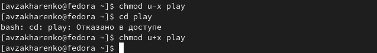

5. Прочитаем man по командам mount, fsck, mkfs, kill.

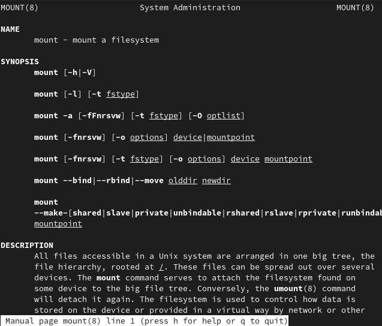

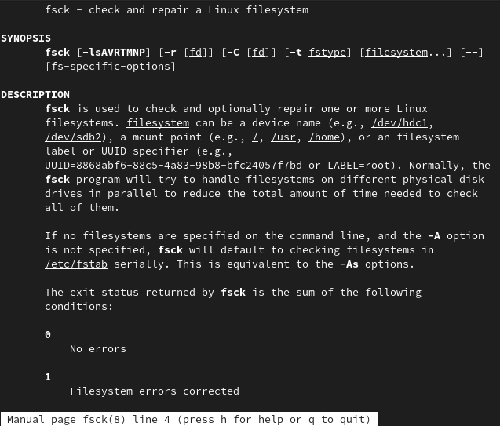

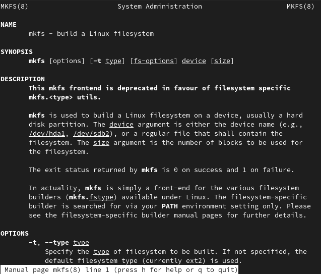

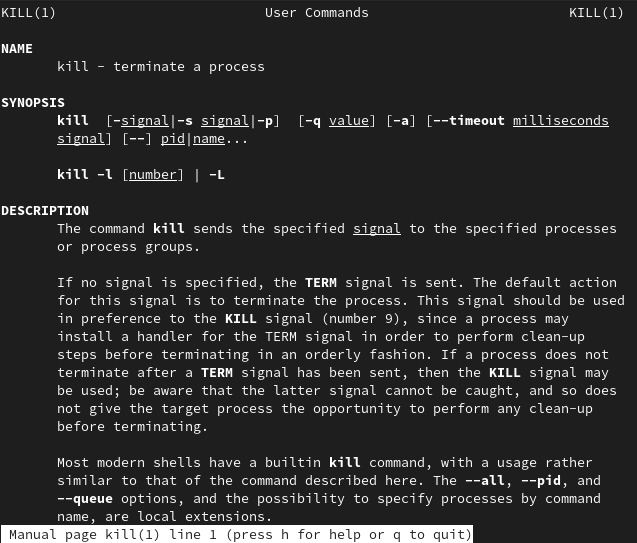
# Выводы
Я ознакомилась с файловой системой Linux, её структурой, именами и содержанием
каталогов.Я приобрела практические навыки по применению команд для работы
с файлами и каталогами, по управлению процессами (и работами), по проверке исполь-
зования диска и обслуживанию файловой системы

# Список литературы{.unnumbered}

::: {#refs}
:::
