---
## Front matter
lang: ru-RU
title: Лабораторная работа №6
subtitle: Поиск файлов. Перенаправление ввода-вывода.
author:
  - Захаренко А.В.
institute:
  - Российский университет дружбы народов, Москва, Россия
date: 13.032023

## i18n babel
babel-lang: russian
babel-otherlangs: english

## Formatting pdf
toc: false
toc-title: Содержание
slide_level: 2
aspectratio: 169
section-titles: true
theme: metropolis
header-includes:
 - \metroset{progressbar=frametitle,sectionpage=progressbar,numbering=fraction}
 - '\makeatletter'
 - '\beamer@ignorenonframefalse'
 - '\makeatother'
---

# Информация

## Докладчик

:::::::::::::: {.columns align=center}
::: {.column width="70%"}

  * Захаренко Анастасия Викторовна
  * студентка первого курса бакалавриата
  * направление бизнес-информатика, факультет физико-математических и естественных наук
  * Российский университет дружбы народов

:::
::: {.column width="30%"}

:::
::::::::::::::

# Элементы презентации

## Актуальность

Ознакомление с инструментами поиска файлов и фильтрации текстовых данных.
Приобретение практических навыков: по управлению процессами (и заданиями), по
проверке использования диска и обслуживанию файловых систем

## Цели и задачи

Поиск файлов.
Перенаправление ввода-вывода.
Просмотр запущенных процуссов.

## Материалы и методы

Конвейер
Конвейер (pipe) служит для объединения простых команд или утилит в цепочки, в ко-
торых результат работы предыдущей команды передаётся последующей. 

Поиск файла
Команда find используется для поиска и отображения на экран имён файлов, соответ-
ствующих заданной строке символов.

Поиск файла
Команда find используется для поиска и отображения на экран имён файлов, соответ-
ствующих заданной строке символов.

##

Проверка использования диска
Команда df показывает размер каждого смонтированного раздела диска
Команда du показывает число килобайт, используемое каждым файлом или каталогом.

Управление задачами
Любую выполняющуюся в консоли команду или внешнюю программу можно запустить
в фоновом режиме. Для этого следует в конце имени команды указать знак амперсанда
&. 

Получение информации о процессах
Команда ps используется для получения информации о процессах.

## Содержание исследования

1. Осуществляем вход в систему, используя соответствующее имя пользователя.
2. Записываем в файл file.txt названия файлов, содержащихся в каталоге /etc. Дописываем в этот же файл названия файлов, содержащихся в вашем домашнем каталоге.

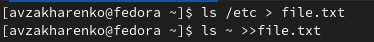

##

3. Выводим имена всех файлов из file.txt, имеющих расширение .conf, после чего
записываем их в новый текстовой файл conf.txt.

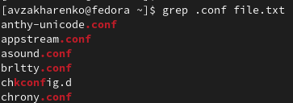

##

##

4. Определяем, какие файлы в вашем домашнем каталоге имеют имена, начинавшиеся
с символа c?Несколькими вариантами.

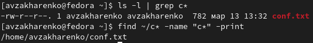

##

5. Выводим на экран (по странично) имена файлов из каталога /etc, начинающиеся
с символа h.

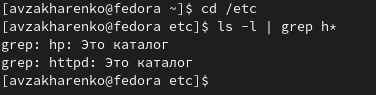

##

6. Запускаем в фоновом режиме процесс, который будет записывать в файл ~/logfile
файлы, имена которых начинаются с log.
7. Удаляем файл ~/logfile.

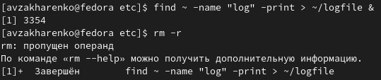

##

8. Запускаем из консоли в фоновом режиме редактор gedit.

##

9. Определяем идентификатор процесса gedit, используя команду ps, конвейер и фильтр
grep.

##

10. Прочитываем справку (man) команды kill, после чего используем её для завершения
процесса gedit.

##

11. Выполняем команды df и du, предварительно получив более подробную информацию
об этих командах, с помощью команды man.

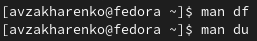

##

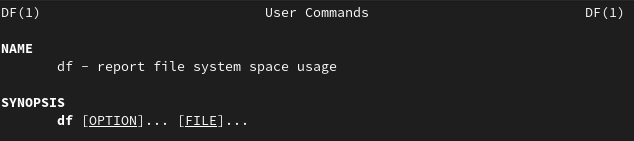

##

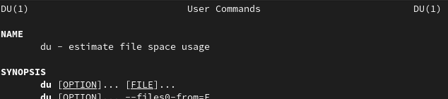

##

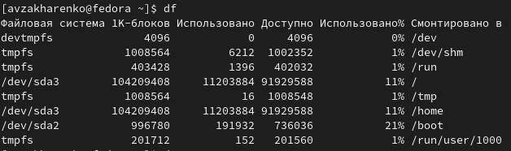

##

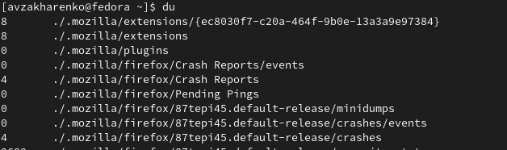

##

12. Воспользовавшись справкой команды find, выводим имена всех директорий, имею-
щихся в нашем домашнем каталоге.

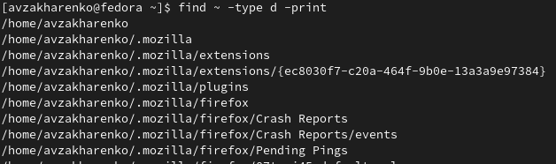

## Результаты

Я ознакомилась с инструментами поиска файлов и фильтрации текстовых данных.
Приобрела практические навыки: по управлению процессами (и заданиями), по
проверке использования диска и обслуживанию файловых систем

