---
## Front matter
title: "Лабораторная работа №6"
subtitle: "Поиск файлов. Перенаправление ввода-вывода."
author: "Захаренко Анастасия Викторовна"

## Generic otions
lang: ru-RU
toc-title: "Содержание"

## Bibliography
bibliography: bib/cite.bib
csl: pandoc/csl/gost-r-7-0-5-2008-numeric.csl

## Pdf output format
toc: true # Table of contents
toc-depth: 2
lof: true # List of figures
lot: true # List of tables
fontsize: 12pt
linestretch: 1.5
papersize: a4
documentclass: scrreprt
## I18n polyglossia
polyglossia-lang:
  name: russian
  options:
	- spelling=modern
	- babelshorthands=true
polyglossia-otherlangs:
  name: english
## I18n babel
babel-lang: russian
babel-otherlangs: english
## Fonts
mainfont: PT Serif
romanfont: PT Serif
sansfont: PT Sans
monofont: PT Mono
mainfontoptions: Ligatures=TeX
romanfontoptions: Ligatures=TeX
sansfontoptions: Ligatures=TeX,Scale=MatchLowercase
monofontoptions: Scale=MatchLowercase,Scale=0.9
## Biblatex
biblatex: true
biblio-style: "gost-numeric"
biblatexoptions:
  - parentracker=true
  - backend=biber
  - hyperref=auto
  - language=auto
  - autolang=other*
  - citestyle=gost-numeric
## Pandoc-crossref LaTeX customization
figureTitle: "Рис."
tableTitle: "Таблица"
listingTitle: "Листинг"
lofTitle: "Список иллюстраций"
lotTitle: "Список таблиц"
lolTitle: "Листинги"
## Misc options
indent: true
header-includes:
  - \usepackage{indentfirst}
  - \usepackage{float} # keep figures where there are in the text
  - \floatplacement{figure}{H} # keep figures where there are in the text
---

# Цель работы

Ознакомление с инструментами поиска файлов и фильтрации текстовых данных.
Приобретение практических навыков: по управлению процессами (и заданиями), по
проверке использования диска и обслуживанию файловых систем

# Задание

Последовательность выполнения работы
1. Осуществите вход в систему, используя соответствующее имя пользователя.
2. Запишите в файл file.txt названия файлов, содержащихся в каталоге /etc. Допи-
шите в этот же файл названия файлов, содержащихся в вашем домашнем каталоге.
3. Выведите имена всех файлов из file.txt, имеющих расширение .conf, после чего
запишите их в новый текстовой файл conf.txt.
4. Определите, какие файлы в вашем домашнем каталоге имеют имена, начинавшиеся
с символа c? Предложите несколько вариантов, как это сделать.
5. Выведите на экран (по странично) имена файлов из каталога /etc, начинающиеся
с символа h.
6. Запустите в фоновом режиме процесс, который будет записывать в файл ~/logfile
файлы, имена которых начинаются с log.
7. Удалите файл ~/logfile.
8. Запустите из консоли в фоновом режиме редактор gedit.
9. Определите идентификатор процесса gedit, используя команду ps, конвейер и фильтр
grep. Как ещё можно определить идентификатор процесса?
10. Прочтите справку (man) команды kill, после чего используйте её для завершения
процесса gedit.
11. Выполните команды df и du, предварительно получив более подробную информацию
об этих командах, с помощью команды man.
12. Воспользовавшись справкой команды find, выведите имена всех директорий, имею-
щихся в вашем домашнем каталоге.

# Теоретическое введение

Конвейер
Конвейер (pipe) служит для объединения простых команд или утилит в цепочки, в ко-
торых результат работы предыдущей команды передаётся последующей. 

Поиск файла
Команда find используется для поиска и отображения на экран имён файлов, соответ-
ствующих заданной строке символов.

Поиск файла
Команда find используется для поиска и отображения на экран имён файлов, соответ-
ствующих заданной строке символов.

Проверка использования диска
Команда df показывает размер каждого смонтированного раздела диска
Команда du показывает число килобайт, используемое каждым файлом или каталогом.

Управление задачами
Любую выполняющуюся в консоли команду или внешнюю программу можно запустить
в фоновом режиме. Для этого следует в конце имени команды указать знак амперсанда
&. 

Получение информации о процессах
Команда ps используется для получения информации о процессах.

# Выполнение лабораторной работы

1. Осуществляем вход в систему, используя соответствующее имя пользователя.
2. Записываем в файл file.txt названия файлов, содержащихся в каталоге /etc. Дописываем в этот же файл названия файлов, содержащихся в вашем домашнем каталоге.

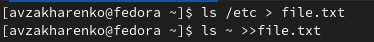

3. Выводим имена всех файлов из file.txt, имеющих расширение .conf, после чего
записываем их в новый текстовой файл conf.txt.

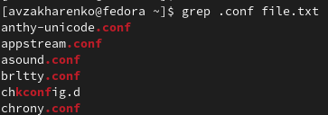

4. Определяем, какие файлы в вашем домашнем каталоге имеют имена, начинавшиеся
с символа c?Несколькими вариантами.

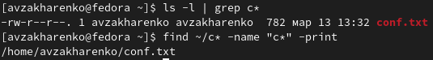

5. Выводим на экран (по странично) имена файлов из каталога /etc, начинающиеся
с символа h.

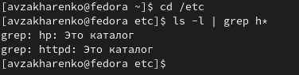

6. Запускаем в фоновом режиме процесс, который будет записывать в файл ~/logfile
файлы, имена которых начинаются с log.
7. Удаляем файл ~/logfile.

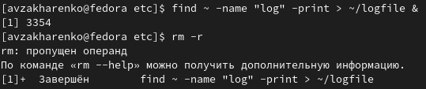

8. Запускаем из консоли в фоновом режиме редактор gedit.

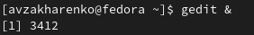

9. Определяем идентификатор процесса gedit, используя команду ps, конвейер и фильтр
grep.

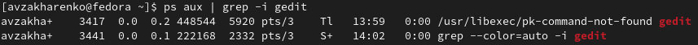

10. Прочитываем справку (man) команды kill, после чего используем её для завершения
процесса gedit.

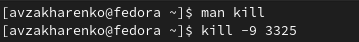

11. Выполняем команды df и du, предварительно получив более подробную информацию
об этих командах, с помощью команды man.

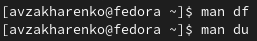

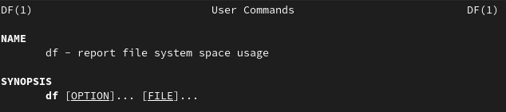

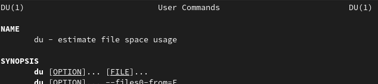

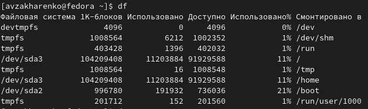

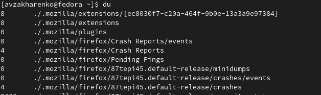

12. Воспользовавшись справкой команды find, выводим имена всех директорий, имею-
щихся в нашем домашнем каталоге.

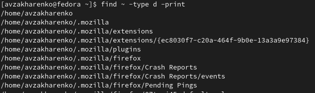

# Выводы

Я ознакомилась с инструментами поиска файлов и фильтрации текстовых данных.
Приобрела практические навыки: по управлению процессами (и заданиями), по
проверке использования диска и обслуживанию файловых систем

# Список литературы{.unnumbered}

::: {#refs}
:::
