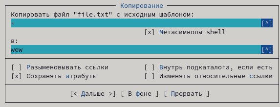

---
## Front matter
lang: ru-RU
title: Лабораторная работа №7
subtitle: Командная оболочка Midnight Commander
author:
  - Захаренко А.В.
institute:
  - Российский университет дружбы народов, Москва, Россия
date: 13.03.2023

## i18n babel
babel-lang: russian
babel-otherlangs: english

## Formatting pdf
toc: false
toc-title: Содержание
slide_level: 2
aspectratio: 169
section-titles: true
theme: metropolis
header-includes:
 - \metroset{progressbar=frametitle,sectionpage=progressbar,numbering=fraction}
 - '\makeatletter'
 - '\beamer@ignorenonframefalse'
 - '\makeatother'
---

# Информация

## Докладчик

:::::::::::::: {.columns align=center}
::: {.column width="70%"}

  * Захаренко Анастасия Викторовна
  * студентка первого курса бакалавриата
  * направление бизнес-информатика, факультет физико-математических и естественных наук
  * Российский университет дружбы народов

:::
::: {.column width="30%"}

:::
::::::::::::::

# Элементы презентации

## Актуальность

Освоение основных возможностей командной оболочки Midnight Commander. Приоб-
ретение навыков практической работы по просмотру каталогов и файлов; манипуляций
с ними.

## Цели и задачи

Задание по mc
Задание по встроенному редактору mc

## Материалы и методы

Командная оболочка — интерфейс взаимодействия пользователя с операционной систе-
мой и программным обеспечением посредством команд.
Midnight Commander (или mc) — псевдографическая командная оболочка для UNIX/Linux
систем. Для запуска mc необходимо в командной строке набрать mc и нажать Enter .
Рабочее пространство mc имеет две панели, отображающие по умолчанию списки
файлов двух каталогов

## Содержание исследования

Задание по mc
1. Изучите информацию о mc, вызвав в командной строке man mc.

##

2. Запустите из командной строки mc, изучите его структуру и меню
3. Выполните несколько операций в mc, используя управляющие клавиши (операции
с панелями; выделение/отмена выделения файлов, копирование/перемещение фай-
лов, получение информации о размере и правах доступа на файлы и/или каталоги
и т.п.)

##

##

##

##

##

##

4. Выполните основные команды меню левой (или правой) панели. Оцените степень
подробности вывода информации о файлах.

##

##

##

##

5. Используя возможности подменю Файл , выполните:
– просмотр содержимого текстового файла;

##

– редактирование содержимого текстового файла (без сохранения результатов
редактирования);

##

##

– создание каталога;

##

– копирование в файлов в созданный каталог.

##

##

6. С помощью соответствующих средств подменю Команда осуществите:
– поиск в файловой системе файла с заданными условиями (например, файла
с расширением .c или .cpp, содержащего строку main);

##

##

– переход в домашний каталог;

##

– анализ файла меню и файла расширений.

##

##

7. Вызовите подменю Настройки . Освойте операции, определяющие структуру экрана mc
(Full screen, Double Width, Show Hidden Files и т.д.)

##

##

##

##

Задание по встроенному редактору mc
1. Создайте текстовой файл text.txt.

##

2. Откройте этот файл с помощью встроенного в mc редактора.
3. Вставьте в открытый файл небольшой фрагмент текста, скопированный из любого
другого файла или Интернета.

##

4. Проделайте с текстом следующие манипуляции, используя горячие клавиши:
4.1. Удалите строку текста.
4.2. Выделите фрагмент текста и скопируйте его на новую строку
4.3. Выделите фрагмент текста и перенесите его на новую строку.
4.4. Сохраните файл.
4.5. Отмените последнее действие.
4.6. Перейдите в конец файла (нажав комбинацию клавиш) и напишите некоторый
текст.
4.7. Перейдите в начало файла (нажав комбинацию клавиш) и напишите некоторый
текст.
4.8. Сохраните и закройте файл.

##

##

##

5. Используя меню редактора, включите подсветку синтаксиса, если она не включена,
или выключите, если она включена

##

## Результаты

Я освоила основные возможности командной оболочки Midnight Commander. Приоб-
рела навыки практической работы по просмотру каталогов и файлов; манипуляций
с ними.

