---
## Front matter
title: "Лабораторная работа №9"
subtitle: "Текстовой редактор emacs"
author: "Захаренко Анастасия Викторовна"

## Generic otions
lang: ru-RU
toc-title: "Содержание"

## Bibliography
bibliography: bib/cite.bib
csl: pandoc/csl/gost-r-7-0-5-2008-numeric.csl

## Pdf output format
toc: true # Table of contents
toc-depth: 2
lof: true # List of figures
lot: true # List of tables
fontsize: 12pt
linestretch: 1.5
papersize: a4
documentclass: scrreprt
## I18n polyglossia
polyglossia-lang:
  name: russian
  options:
	- spelling=modern
	- babelshorthands=true
polyglossia-otherlangs:
  name: english
## I18n babel
babel-lang: russian
babel-otherlangs: english
## Fonts
mainfont: PT Serif
romanfont: PT Serif
sansfont: PT Sans
monofont: PT Mono
mainfontoptions: Ligatures=TeX
romanfontoptions: Ligatures=TeX
sansfontoptions: Ligatures=TeX,Scale=MatchLowercase
monofontoptions: Scale=MatchLowercase,Scale=0.9
## Biblatex
biblatex: true
biblio-style: "gost-numeric"
biblatexoptions:
  - parentracker=true
  - backend=biber
  - hyperref=auto
  - language=auto
  - autolang=other*
  - citestyle=gost-numeric
## Pandoc-crossref LaTeX customization
figureTitle: "Рис."
tableTitle: "Таблица"
listingTitle: "Листинг"
lofTitle: "Список иллюстраций"
lotTitle: "Список таблиц"
lolTitle: "Листинги"
## Misc options
indent: true
header-includes:
  - \usepackage{indentfirst}
  - \usepackage{float} # keep figures where there are in the text
  - \floatplacement{figure}{H} # keep figures where there are in the text
---

# Цель работы

Познакомиться с операционной системой Linux. Получить практические навыки рабо-
ты с редактором Emacs

# Задание

1. Ознакомиться с теоретическим материалом.
2. Ознакомиться с редактором emacs.
3. Выполнить упражнения.

# Теоретическое введение

Определение 1. Буфер — объект, представляющий какой-либо текст.
Буфер может содержать что угодно, например, результаты компиляции программы
или встроенные подсказки. Практически всё взаимодействие с пользователем, в том
числе интерактивное, происходит посредством буферов.
Определение 2. Фрейм соответствует окну в обычном понимании этого слова. Каждый
фрейм содержит область вывода и одно или несколько окон Emacs.
Определение 3. Окно — прямоугольная область фрейма, отображающая один из буфе-
ров.
Каждое окно имеет свою строку состояния, в которой выводится следующая информа-
ция: название буфера, его основной режим, изменялся ли текст буфера и как далеко вниз
по буферу расположен курсор. Каждый буфер находится только в одном из возможных
основных режимов. Существующие основные режимы включают режим Fundamental
(наименее специализированный), режим Text, режим Lisp, режим С, режим Texinfo
и другие. Под второстепенными режимами понимается список режимов, которые вклю-
чены в данный момент в буфере выбранного окна.
Определение 4. Область вывода — одна или несколько строк внизу фрейма, в которой
Emacs выводит различные сообщения, а также запрашивает подтверждения и дополни-
тельную информацию от пользователя.
Определение 5. Минибуфер используется для ввода дополнительной информации и все-
гда отображается в области вывода.
Определение 6. Точка вставки — место вставки (удаления) данных в буфере.

# Выполнение лабораторной работы

1. Открываем emacs.

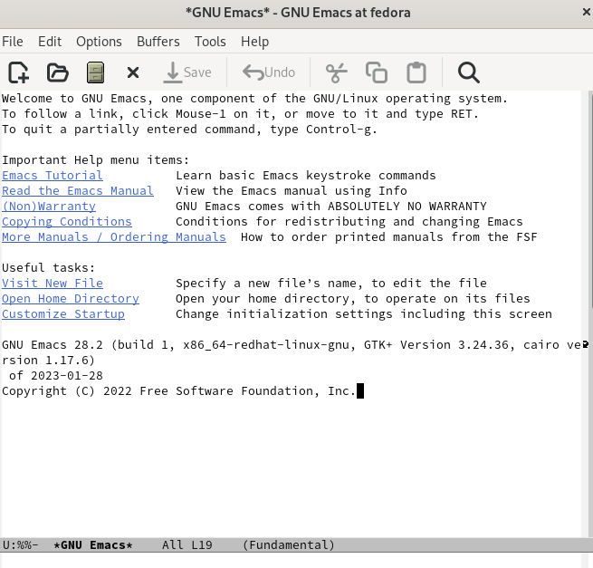

2. Создаем файл lab07.sh с помощью комбинации Ctrl-x Ctrl-f (C-x C-f).
3. Набираем текст:
1 #!/bin/bash
2 HELL=Hello
3 function hello {
4 LOCAL HELLO=World
5 echo $HELLO
6 }
7 echo $HELLO
8 hello
4. Сохранить файл с помощью комбинации Ctrl-x Ctrl-s (C-x C-s).

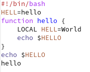

5. Проделать с текстом стандартные процедуры редактирования, каждое действие долж-
но осуществляться комбинацией клавиш.
5.1. Вырезать одной командой целую строку (С-k).
5.2. Вставить эту строку в конец файла (C-y).

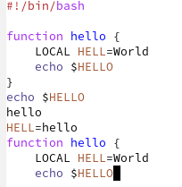

5.3. Выделить область текста (C-space).
5.4. Скопировать область в буфер обмена (M-w).
5.5. Вставить область в конец файла.
5.6. Вновь выделить эту область и на этот раз вырезать её (C-w).
5.7. Отмените последнее действие (C-/).

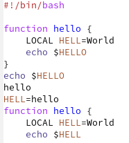

6. Управление буферами.
6.1. Вывести список активных буферов на экран (C-x C-b)

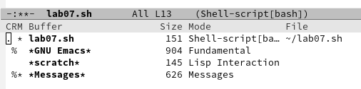

6.2. Переместитесь во вновь открытое окно (C-x) o со списком открытых буферов
и переключитесь на другой буфер.

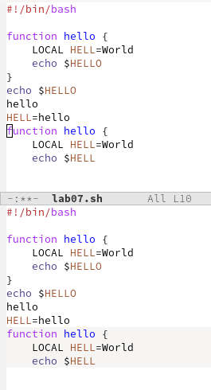

6.3. Закройте это окно (C-x 0).
6.4. Теперь вновь переключайтесь между буферами, но уже без вывода их списка на
экран (C-x b).

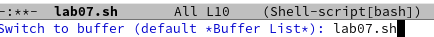

7. Управление окнами.
7.1. Поделите фрейм на 4 части: разделите фрейм на два окна по вертикали (C-x 3),
а затем каждое из этих окон на две части по горизонтали (C-x 2) 

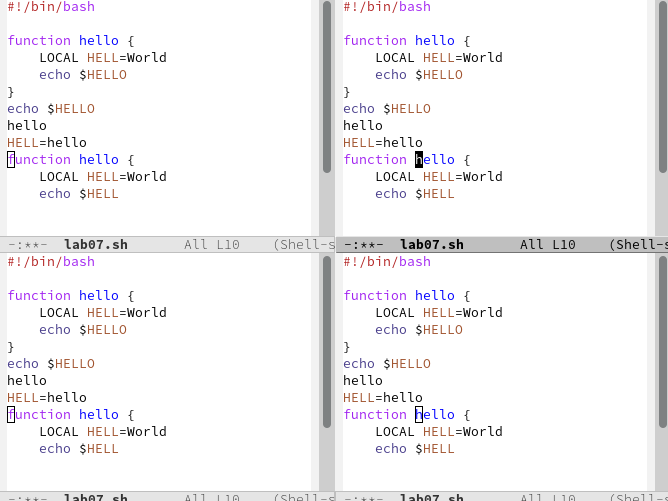

8. Режим поиска
8.1. Переключитесь в режим поиска (C-s) и найдите несколько слов, присутствующих
в тексте.

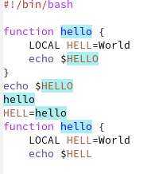

8.2. Переключайтесь между результатами поиска, нажимая C-s.

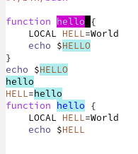

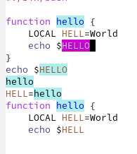

8.3. Выйдите из режима поиска, нажав C-g.

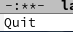

8.4. Испробуйте другой режим поиска, нажав M-s o. 

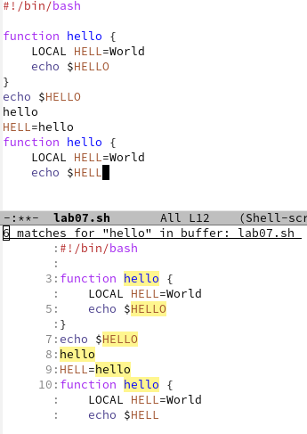

# Выводы

Я познакомилась с операционной системой Linux. Получла практические навыки рабо-
ты с редактором Emacs

# Список литературы{.unnumbered}

::: {#refs}
:::
