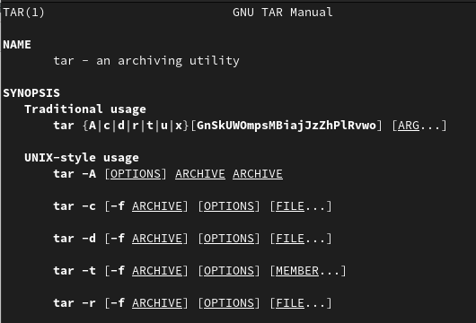
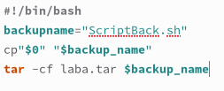
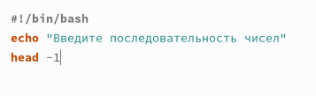
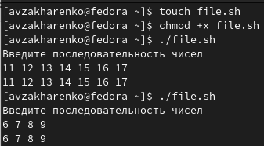
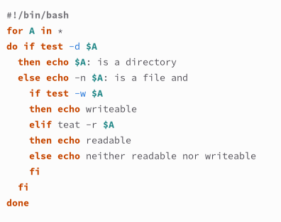
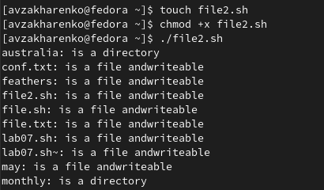
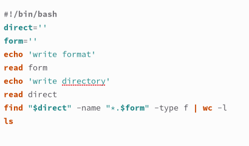
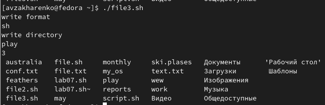

---
## Front matter
lang: ru-RU
title: Лабораторная работа №10
subtitle: Программирование в командном процессоре ОС UNIX. Командные файлы
author:
  - Захаренко А.В.
institute:
  - Российский университет дружбы народов, Москва, Россия
date: 17.03.2023

## i18n babel
babel-lang: russian
babel-otherlangs: english

## Formatting pdf
toc: false
toc-title: Содержание
slide_level: 2
aspectratio: 169
section-titles: true
theme: metropolis
header-includes:
 - \metroset{progressbar=frametitle,sectionpage=progressbar,numbering=fraction}
 - '\makeatletter'
 - '\beamer@ignorenonframefalse'
 - '\makeatother'
---

# Информация

## Докладчик

:::::::::::::: {.columns align=center}
::: {.column width="70%"}

  * Захаренко Анастасия Викторовна
  * студентка первого курса бакалавриата
  * направление бизнес-информатика, факультет физико-математических и естественных наук
  * Российский университет дружбы народов

:::
::: {.column width="30%"}

:::
::::::::::::::

# Элементы презентации

## Актуальность

Изучить основы программирования в оболочке ОС UNIX/Linux. Научиться писать
небольшие командные файлы

## Цели и задачи

1. Написать скрипт, который при запуске будет делать резервную копию самого себя в другую директорию backup в вашем домашнем каталоге.
2. Написать пример командного файла, обрабатывающего любое произвольное число
аргументов командной строки, в том числе превышающее десять.
3. Написать командный файл — аналог команды ls 
4. Написать командный файл, который получает в качестве аргумента командной строки
формат файла (.txt, .doc, .jpg, .pdf и т.д.) и вычисляет количество таких файлов
в указанной директории.

## Материалы и методы

Командный процессор (командная оболочка, интерпретатор команд shell) — это про-
грамма, позволяющая пользователю взаимодействовать с операционной системой
компьютера. В операционных системах типа UNIX/Linux наиболее часто используются
следующие реализации командных оболочек:
– оболочка Борна (Bourne shell или sh) — стандартная командная оболочка UNIX/Linux,
содержащая базовый, но при этом полный набор функций;
– С-оболочка (или csh) — надстройка на оболочкой Борна, использующая С-подобный
синтаксис команд с возможностью сохранения истории выполнения команд;
– оболочка Корна (или ksh) — напоминает оболочку С, но операторы управления програм-
мой совместимы с операторами оболочки Борна;
– BASH — сокращение от Bourne Again Shell (опять оболочка Борна), в основе своей совмещает свойства оболочек С и Корна (разработка компании Free Software Foundation).

##

POSIX (Portable Operating System Interface for Computer Environments) — набор стандартов
описания интерфейсов взаимодействия операционной системы и прикладных программ.
Стандарты POSIX разработаны комитетом IEEE (Institute of Electrical and Electronics
Engineers) для обеспечения совместимости различных UNIX/Linux-подобных опера-
ционных систем и переносимости прикладных программ на уровне исходного кода.
POSIX-совместимые оболочки разработаны на базе оболочки Корна.

## Содержание исследования

1. Напишем скрипт, который при запуске будет делать резервную копию самого себя  в другую директорию backup в вашем домашнем каталоге. 

##

##

##

##

2. Напишем пример командного файла, обрабатывающего любое произвольное число
аргументов командной строки, в том числе превышающее десять. 

##

##

##

3. Напишем командный файл — аналог команды ls 

##

##

##

4. Напишем командный файл, который получает в качестве аргумента командной строки
формат файла (.txt, .doc, .jpg, .pdf и т.д.) и вычисляет количество таких файлов
в указанной директории. 

##

##

## Результаты

Я изучила основы программирования в оболочке ОС UNIX/Linux. Научилась писать
небольшие командные файлы

