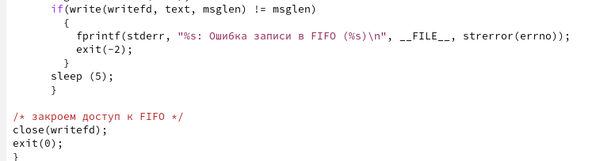

---
## Front matter
lang: ru-RU
title: Лабораторная работа №14
subtitle: Именованные каналы
author:
  - Захаренко А.В.
institute:
  - Российский университет дружбы народов, Москва, Россия
date: 10 апреля 2023

## i18n babel
babel-lang: russian
babel-otherlangs: english

## Formatting pdf
toc: false
toc-title: Содержание
slide_level: 2
aspectratio: 169
section-titles: true
theme: metropolis
header-includes:
 - \metroset{progressbar=frametitle,sectionpage=progressbar,numbering=fraction}
 - '\makeatletter'
 - '\beamer@ignorenonframefalse'
 - '\makeatother'
---

# Информация

## Докладчик

:::::::::::::: {.columns align=center}
::: {.column width="70%"}

  * Захаренко Анастасия Викторовна
  * студентка первого курса бакалавриата
  * направление бизнес-информатика, факультет физико-математических и естественных наук
  * Российский университет дружбы народов

:::
::: {.column width="30%"}

:::
::::::::::::::

# Элементы презентации

## Актуальность

Приобретение практических навыков работы с именованными каналами.

## Цели и задачи

Изучите приведённые в тексте программы server.c и client.c. Взяв данные примеры
за образец, напишите аналогичные программы, внеся следующие изменения:
1. Работает не 1 клиент, а несколько (например, два).
2. Клиенты передают текущее время с некоторой периодичностью (например, раз в пять
секунд). Используйте функцию sleep() для приостановки работы клиента.
3. Сервер работает не бесконечно, а прекращает работу через некоторое время (напри-
мер, 30 сек). Используйте функцию clock() для определения времени работы сервера.
Что будет в случае, если сервер завершит работу, не закрыв канал?

## Материалы и методы

Одним из видов взаимодействия между процессами в операционных системах яв-
ляется обмен сообщениями. Под сообщением понимается последовательность байтов,
передаваемая от одного процесса другому.
В операционных системах типа UNIX есть 3 вида межпроцессорных взаимодействий:
общеюниксные (именованные каналы, сигналы), System V Interface Definition (SVID —
разделяемая память, очередь сообщений, семафоры) и BSD (сокеты).
Для передачи данных между неродственными процессами можно использовать меха-
низм именованных каналов (named pipes). 

##

Данные передаются по принципу FIFO (First
In First Out) (первым записан — первым прочитан), поэтому они называются также FIFO
pipes или просто FIFO. Именованные каналы отличаются от неименованных наличием
идентификатора канала, который представлен как специальный файл (соответственно
имя именованного канала — это имя файла). Поскольку файл находится на локальной
файловой системе, данное IPC используется внутри одной системы

## Содержание исследования

1. Я создала необходимые для работы файлы(common.h, server.c, client.c, Makefile)

##

##

2. Далее я скопировала коды из лабораторной и дополнила их в соответствии с заданием.
3. common.h: добавила стандартные заголовочные файлы unistd.h, time.h.

##

4. server.c: добавила цикл для контроля за временем работы сервера.

##

##

##

5. client.c: добавила цикл, отвечающий за кол-во сообщений о текущем времени.

##

##

6. Makefile: проставила таб вместо пробелов в 4 и тд. строке

##

7. Далее скомпилировала все файлы

##

8. В конце я проверила работу сервера, используя команды: ./server, ./client

##

## Результаты

Я приобрела практические навыки работы с именованными каналами.

